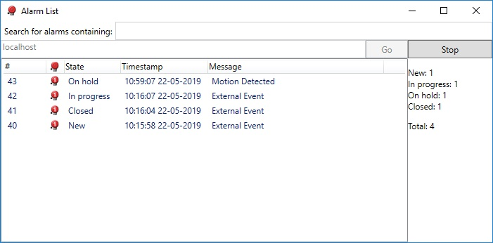

# Alarm List

The AlarmList is a C\# .NET sample showing how to connect to an XProtect
Event Server. When connected, the sample continuously queries the 10
newest alarms, which match a given filter. It also continuously
reports the total number of alarms with any given state.

The sample uses a WSDL client proxy which accesses the Event Server\'s
alarm data.

>Note, it is important to specify http or https in the server address, to ensure correct connection to a secure or unsecure Event Server.

## The sample demonstrates

- How to connect to XProtect Event Server with different credentials
- Query 10 alarms matching a filter
- Query statistics about all alarms
- Alarm list view with WPF

## Using

- Microsoft.NET

## Environment

- C\#, WPF and .NET

## Visual Studio C\# project

- [AlarmList.csproj](javascript:clone('https://github.com/milestonesys/mipsdk-samples-protocol','src/ProtocolSamples.sln');)
