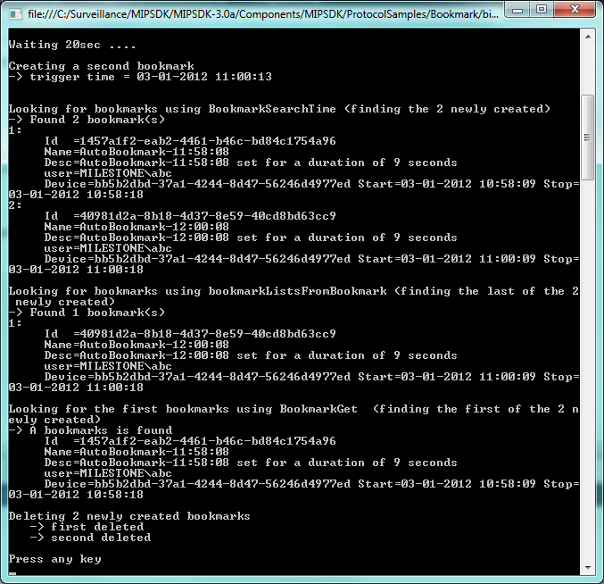

# Bookmark Creator

This sample shows how a minimal part of the ServerCommmandService SOAP
proxy can be used for creating bookmarks, and retrieving bookmarks.

The sample will only work towards XProtect Corporate, Expert, and
Professional+.

After the login is successful, it will automatically perform these
bookmark operations:

- Create first bookmark
- Create a second bookmark
- Looking for bookmarks using BookmarkSearchTime
- Looking for bookmarks using bookmarkListsFromBookmark
- Looking for the first bookmarks using BookmarkGet
- Deleting the 2 newly created bookmarks

## MIP Environment - Protocol

## The sample demonstrates

- Use of ServerCommandService for performing bookmark create, get and delete

## Using

- ServerCommandService proxy

## Environment

- None

## Visual Studio C\# project

- [BookmarkCreator.csproj](javascript:clone('https://github.com/milestonesys/mipsdk-samples-protocol','src/ProtocolSamples.sln');)
