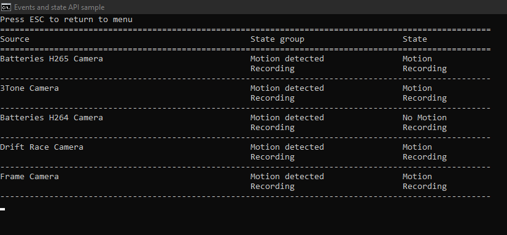

# Event and State WebSocket API - Python

This sample demonstrates how to access the Events and State WebSocket API through the API Gateway from a Python application.



## Prerequisites

- XProtect 2023 R3 or later with API Gateway installed
- Items configured, that can trigger events (e.g. cameras or user-defined events)
- Credentials for a user in the VMS (basic or Windows user)
- Python 3.11 (<https://www.python.org/>)
- Packages listed in `requirements.txt`:

  ```shell
  pip install -r requirements.txt
  ```

### Run

```shell
python main.py
```

## The sample demonstrates

- How to create a WebSocket connection and authenticate on the Events and State API
- How to create a session and resume the session in case of a connection failure (recovering missed events)
- How to make a subscription based on a source, a source type and/or an event type
- How to keep track of the state of configuration items based on stateful events
- How to get the current state based on an active subscription
- How to use the Configuration RESTful API to look up ids in the event: source, event type, and event group.

### Subscription options

The basic subscription filter is defined in the top of `main.py` and can be modified for different sources, a source types and/or an event types.
A few ids for some common events types can be found in `event_type.py`.

To define a more advanced subscription with multiple filters (potentially including 'exclude' filters), see the `create_subscription()` method in `ess_api.py`.

### Simplified example

```python
gateway_ws_uri = "wss://localhost/api/ws/events/v1/"
access_token = "<insert token>"
session_id = ""
last_event_id = ""
subscription_filters =  [
    {
        "modifier": "include",
        "resourceTypes": [ "outputs" ],
        "sourceIds": [ "*" ],
        "eventTypes": [ "*" ]
    }
]
while True:
    try:
        async with connect(gateway_ws_uri, extra_headers={"Authorization": f"Bearer {access_token}"}) as web_socket:
            # Start or resume session
            session = await ess_api.start_session(web_socket, session_id, last_event_id)
            if session["status"] == 201:
                # Create subscription
                subscription = await ess_api.create_subscription(web_socket, subscription_filters)
                # Save session id once subscription is successfully created
                session_id = session["sessionId"]
                # Get state (if needed)
                state = await ess_api.get_state(web_socket)
                # TODO: Process state
            # Receive events loop
            while True:
                events = await ess_api.receive_events(web_socket)
                last_event_id = events["events"][-1]["id"]
                
                # TODO: Process events
    except:
        # TODO: Exception handling
        # Sleep 1 second before reconnecting
        await asyncio.sleep(1)
        print("Reconnecting...")
```

## Using

- Event and State WebSocket API
- Configuration RESTful API
- OpenID Connect/OAuth2

## Visual Studio Python project

* [EventsAndStateWebSocketApiPython.pyproj](javascript:clone('https://github.com/milestonesys/mipsdk-samples-protocol','src/ProtocolSamples.sln');)
