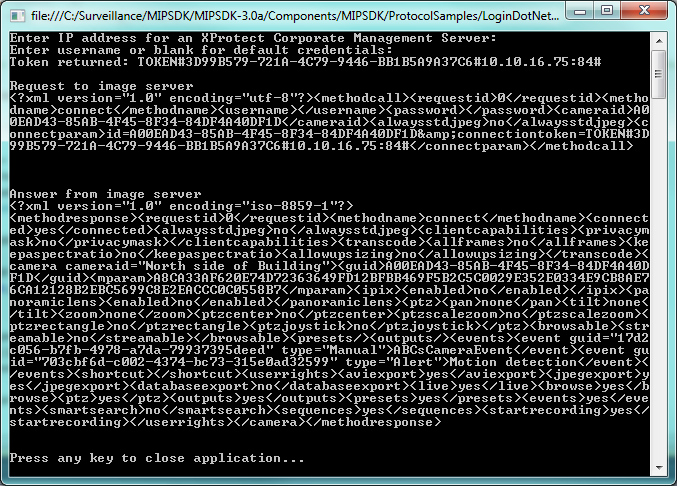

# Login .NET SOAP

This sample shows how a minimal part of the ServerCommmandService SOAP
proxy can be implemented for performing a logon to an XProtect system.

After the login is successful, it will connect to one camera and display
the result on the console.

Please note that the sample is using a hardcoded GUID to identify a
camera, as well as the recording server port.

## MIP Environment - Protocol

The readable part of the protocol communication is displayed in the
console window.

For information about login, please refer to <a href="https://doc.developer.milestonesys.com/html/index.html?base=gettingstarted/intro_environments_login.html&tree=tree_4.html"  target="_top">Introduction to MIP Environments and Login</a>

## The sample demonstrates

- Use of ServerCommandService for performing login
- Formatting of XML on the ImageServer protocol.

## Using

- ServerCommandService proxy
- ImageServer protocol

## Environment

- None

## Visual Studio C\# project

- [LoginDotNetSoap.csproj](javascript:clone('https://github.com/milestonesys/mipsdk-samples-protocol','src/ProtocolSamples.sln');)
