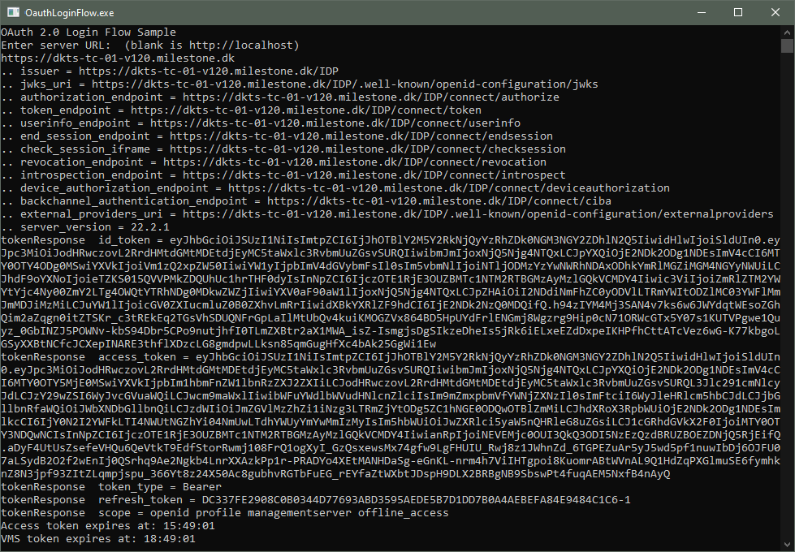

# OAuth login flow

This sample shows how to sign in to XProtect as a user managed by an external
identity provider, for example Okta.

The login flow consists of a number of steps:

- Get list of well-known URIs
- Get hold of URL for an external IDP
- Launch browser page to let user enter credentials
- Receive a browser redirect to pick up a `code`
- Use `code` to asks local IDP for tokens: `access_token`, `refresh_token`, `id_token`
- Use `access_token` to login to VMS, and get `vms_token`
- Save relevant info for refresh of tokens
- Refresh of `access_token` when relevant
- Refresh of `vms_token` when relevant

The sample asks for an XProtect VMS server URL, and defaults to `http://localhost` if none is entered.

The sample then proceeds through all above steps, and writes information to the console.

For information about login, please refer to <a href="https://doc.developer.milestonesys.com/html/index.html?base=gettingstarted/intro_environments_login.html&tree=tree_4.html" target="_top">Introduction to MIP Environments and Login</a>

## Prerequisites

You must have configured an external identity provider for the XProtect VMS. For information about settings up external indentity provider, please refer to [Configure External IDP](https://doc.milestonesys.com/latest/en-US/standard_features/sf_mc/sf_mcnodes/sf_6security/mc_addandconfigureexternalidp.htm)

## The sample demonstrates

- Sign-in via OIDC and OAuth 2.0 using an external identity provider
- Refresh of OAuth `access_token` and XProtect `vms_token`

## Using

- IDP `token_endpoint` for login and refresh of `access_token`
- ServerCommandService for login and refresh of `vms_token`

## Environment

- None

## Visual Studio C\# project

- [OAuthLoginFlow.csproj](javascript:clone('https://github.com/milestonesys/mipsdk-samples-protocol','src/ProtocolSamples.sln');)
