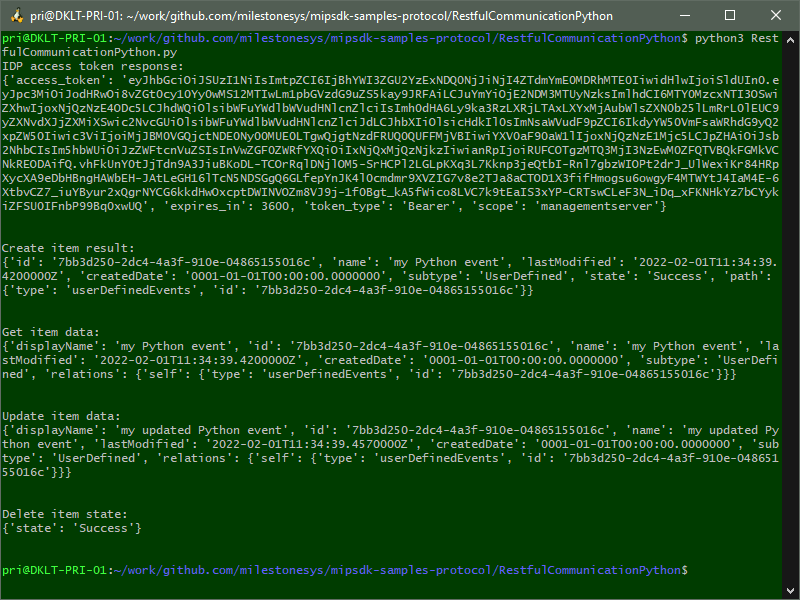

# RESTful Config API - Python

This sample shows how to use the RESTful API Gateway from a Python application. It demonstrates basic CRUD operations, asynchronously invoking a task, checking up on the task status, and duplicating a rule.

The sample logs into the server, creates, gets, updates, and deletes a user-defined event, with diagnostic output along the way. In addition, it shows how to retrieve a list of cameras, and perform a task on one of these cameras.

## Prerequisites

- XProtect 2021 R2 or later.
- The API Gateway installed on the same host as the management server.
- A user with the Administrators role.
- A PTZ camera with PTZ Presets if you'd like to run the `cameras_and_tasks()` part of the sample.
- Python version 3.7 or newer.
- The Python packages 'requests' and 'requests-ntlm'. To install the package:
  - In a command prompt, enter `pip install <package-name>`.
  - In Visual Studio Solution Explorer, select a Python environment under Python Environments, then from the context menu select Manage Python Packages and search for *\<package-name>*. TODO how to open Python Environments, widen window to see Packages tab
  
The sample is verified with the following versions of Python packages:
- requests: 2.26.0
- requests-ntlm: 1.2.0
- urllib3: 1.26.16

Using different package versions might result in unexpected errors when running the sample.

## The sample demonstrates

- How to login using OpenID Connect/OAuth2 from a Python application
- How to access the API Gateway from a Python application
- How to use the RESTful API to perform basic CRUD operations
- How to use the RESTful API to invoke and monitor tasks

## Using

- RESTful Config API

## Related samples

- mipsdk-samples-component/RestfulCommunication
- mipsdk-samples-protocol/AlarmsRestApiPython
- mipsdk-samples-protocol/EventsRestApiPython

## Environment

- None

## Visual Studio Python project

- [RestfulCommunicationPython.pyproj](javascript:clone('https://github.com/milestonesys/mipsdk-samples-protocol','src/ProtocolSamples.sln');)