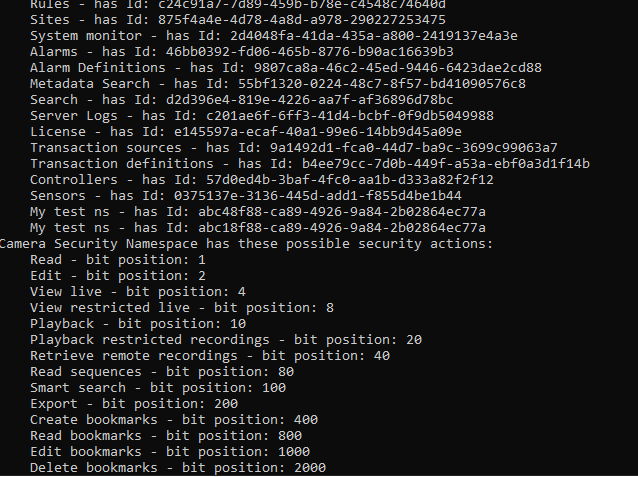

# Security permission demonstrated

This sample shows how to check for security permissions for the current logged in user.  
It also shows how to perform login with basic and windows users.

The sample flow consists of a number of steps:

- Get list of well-known URIs
- Call IDP to perform login 
- Retrieve and show all defined security namespaces
- Show all possible security permisions (actions) for the camera security namespace
- Lookup first available camera, and show what permissions you have on that
- It also checks if you are part of the Administrator role, which has all permissions

The sample has parameters defined in the Program.cs file, please update before executing.
Look at the '//TODO' comments.

For information about login, please refer to <a href="https://doc.developer.milestonesys.com/html/index.html?base=gettingstarted/intro_environments_login.html&tree=tree_4.html" target="_top">Introduction to MIP Environments and Login</a>

## Prerequisites

You must have a configured camera in the XProtect VMS. 

## The sample demonstrates

- How to check for permissions
- How to retrieve all security namespace definitions

## Using

- IDP `token_endpoint` for login 
- API Gateway for accessing 'securityNamespaces' and 'effectivePermissions' restfull endpoints

## Environment

- None

## Visual Studio C\# project

- [SecurityPermission.csproj](javascript:clone('https://github.com/milestonesys/mipsdk-samples-protocol','src/ProtocolSamples.sln');)
