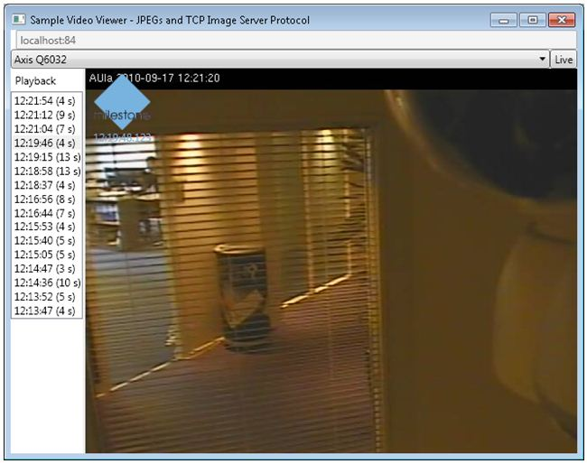

# TCP Video Viewer

This sample shows how to utilize the Image Server protocol to retrieve a
sequence of images.

The application logs in to the server you specify and lets the user
select a camera from a dropdown.

A list of recorded sequences are displayed on the left. When you select
one, the relevant sequence of video will be shown.

The sample demonstrates many of the key XML elements used on the Image
Server protocol. The sample also shows the protocol differences between
viewing in live mode and when retrieving recorded images.

## The sample demonstrates

-   How to utilize the Image Server protocol for retrieving recorded
    images
-   How to utilize the Image Server protocol for viewing live video
-   How to ask recording server to transcode all frames to JPEG,
    regardless of original codec
-   Usage of XML formatting on the Image Server protocol

## Using

-   ImageServer protocol

## Environment

-   None

## Visual Studio C\# project

-   [TcpVideoViewer.csproj](javascript:openLink('..\\\\ProtocolSamples\\\\TcpVideoViewer\\\\TcpVideoViewer.csproj');)
