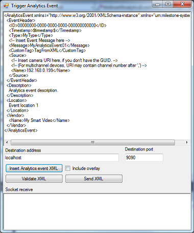
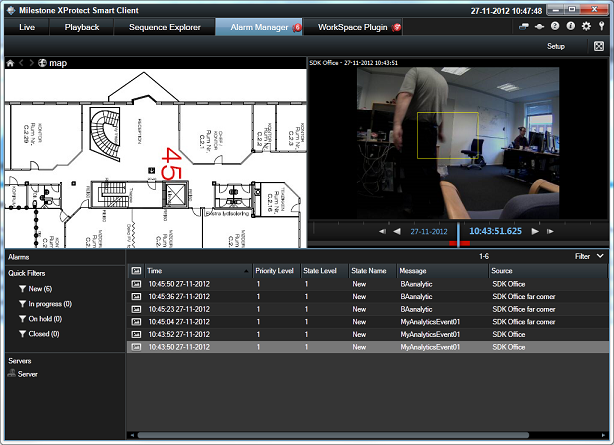

# Analytics Event Trigger via XML

Trigger Analytics Event with XML code sample

This sample demonstrates how to submit an Analytics Event to the Event
Server. The Analytics Event can be seen on the event list in the Smart
Client, can be used for additional Smart Client plugins for e.g. overlay
display, as well as be displayed in 3rd-party applications.

Alarm Definitions can be configured to create alarms based on Analytics
events and the alarms can be seen in the Smart Client.

## How to configure and run the sample

- Setup an analytics event named MyAnalyticsEvent01 in your Management Client.
- Setup an alarm that is created based on the analytics event (the name
  configured above).

- Start the sample, click on "Insert Analytics event XML", define the
  source as a camera in the system by putting its IP address in the
  Name node \<Name\>192.168.0.199\</Name\> section, hit the "Send XML"
  button.
  - Note: Port 9090 is disabled by default, enable in Management
    Client: Tools-\>Options-\>Analytics Event panel.
- Use the Smart Client Alarm Manager tab to see the Alarm in the Alarm
  List.

- Switch the Smart Client alarm list to show events and see the event.
  (You can omit step 2 and 4 if you would like to use analytics event
  without using alarms.)

This sample can be used for experimentation; as you can change the XML
in the textbox and send again and again. The XML can be validated by use
of the XSD, or submitted to the Event Server which will validate it and
respond with OK or an error message.

## The sample demonstrates

- How to submit an analytics event via XML to the Event Server
- How to validate the result of the transmission

## Using

- Sending XML with HTTP header using System.Net.Sockets.Socket
- AnalyticsEvent schema
- Both XML in MAD format and in AnalyticsEvent format is showed.

## Environment

- None

## Visual Studio C\# project

- [TriggerAnalyticsEventXML.csproj](javascript:clone('https://github.com/milestonesys/mipsdk-samples-protocol','src/ProtocolSamples.sln');)
