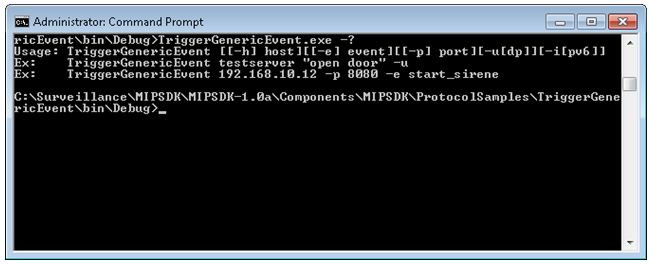

# Trigger Generic Event

This sample can send a character string to the XProtect Generic Event
interpreter.

Be aware that the configuration can be set to specific character set on
different ports. This sample will fit the data source named
\'International\', listening on port 1235.

The sample uses the command line parameters for connecting to the server
and sends the defined string to that server. For UDP communication the
string is contained in one packet, for TCP the session is created, the
string is send and the session should be disconnected again shortly
thereafter.

The following screenshot shows the options for command line parameters.

## The sample demonstrates

-   How to send a character string to the XProtect Generic Event
    interpreter.

## Using

-   Standard Windows .NET sockets

## Environment

-   None

## Visual Studio C\# project

-   [TriggerGenericEvent.csproj](javascript:openLink('..\\\\ProtocolSamples\\\\TriggerGenericEvent\\\\TriggerGenericEvent.csproj');)

## Special notes

Also investigate this sample:

-   [TriggerGenericEventStream.csproj](javascript:openLink('..\\\\ProtocolSamples\\\\TriggerGenericEventStream\\\\TriggerGenericEventStream.csproj');)

Also note that the configuration performed by the Management Client can
modify the port and character set used for this transmission.

Port 1235 and 1234 are disabled by default, please check Management
Client-\>Tools-\>Options-\>Generic Event tab to configure.
