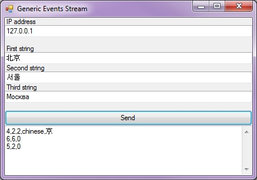

# Trigger Generic Event Stream

This sample can send a stream of characters to the XProtect Generic
Event interpreter.

The stream consists of three strings separated with carriage-return,
line-feed and fits the data source named international listening on port
1235. Your application could send an endless stream the same way as
shown here.

The difference between this sample and the Trigger Generic Event sample
is that this sample will keep a TCP/IP session open continuously and
send characters when they appear. The XProtect system can be configured
to separate multiple events within a session.

The following screenshot shows the UI.

## The sample demonstrates

- How to send a stream of characters encoded as UTF-8 to the XProtect
  Generic Event interpreter

## Using

- Standard Windows .NET sockets

## Environment

- None

## Visual Studio C\# project

- [TriggerGenericEventStream.csproj](javascript:clone('https://github.com/milestonesys/mipsdk-samples-protocol','src/ProtocolSamples.sln');)

## Special notes

For sending single events at a time, you may investigate this sample:

- [TriggerGenericEvent.csproj](javascript:clone('https://github.com/milestonesys/mipsdk-samples-protocol','src/ProtocolSamples.sln');)

Also note that the configuration performed by the Management Client can
modify the port and character set used for this transmission.

Port 1235 and 1234 are disabled by default, please check Management
Client-\>Tools-\>Options-\>Generic Event tab to configure.
