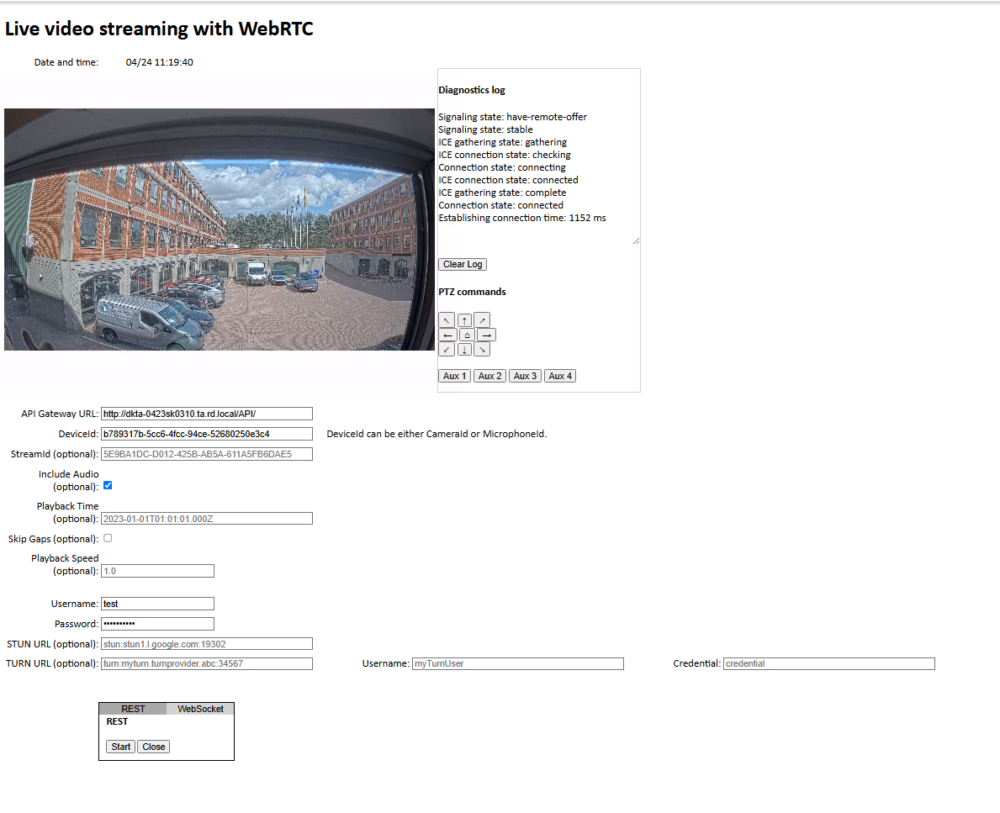

<!-- markdownlint-disable MD024 -->

# WebRTC - JavaScript client

This sample uses a RESTful API for the signaling required to establish a WebRTC connection with an XProtect VMS through the API Gateway.

## Prerequisites

- XProtect 2023 R1 or later.
- Camera with H.264 protocol.
- An XProtect basic user, created locally, with access to the camera.
- Chrome, Edge, Firefox, or Safari web browser.
- CORS configuration if the sample webpage is not served from the same origin host URL as the API Gateway, see [API Gateway CORS settings][cors].
- No symmetric NAT *between* browser and the API Gateway, see [No WebRTC connection through a symmetric NAT firewall][symm-nat].
- If both browser and the API Gateway are on a local private network:
  - Both on same local network segment and API Gateway supports mDNS, see [WebRTC connection on a local network uses mDNS][locm], or
  - Routers on local network does not block `X-Forwarded-For` or `Remote_Addr` headers, see [WebRTC connections across routers in a local network][loch], or
  - mDNS disabled in the browser, see [Disable browser mDNS support][disa]

## Set up WebRTC sample

You can open the sample webpage `index.html` in a browser directly from the sample directory, or host the sample directory `WebRTC_JavaScript` on a web server.

If you intend to serve the sample directly from the sample directory:

1. Configure [API Gateway CORS settings][cors].

If you intend to serve the sample from a web server:

1. Copy the `WebRTC_JavaScript` sample directory to a host with a web server, for example the API Gateway host.
2. Configure the web server to serve the sample directory at, for example, `/WebRTC_JavaScript`.
3. If the sample webpage is *not* served from the same host URL as the API Gateway, you must configure [API Gateway CORS settings][cors].

## Configuration files

API Gateway configuration files are located in the installation location, by default `%ProgramFiles%\Milestone\XProtect API Gateway\`.

These configuration files are relevant for the sample:

- `appsettings.production.json`: Overrides the configuration settings in `appsettings.json`.
- `appsettings.json`: Reverse proxy (routing), CORS, WebRTC, log levels, etc.

> Do not edit `appsettings.json` manually. This file is created by the product installer and maintained by the **Server Configurator**.

If needed, create `appsettings.production.json` and add configuration overrides to this file. This file will not be removed or changed by product updates.

> Use a validating editor to edit configuration files. Most popular code editors support JSON and XML syntax validation, either by default or through extensions.

Syntax errors in the API Gateway configurations files result in `502 Bad Gateway` or `503 Service Unavailable` server errors and will show up in the Windows Application event log and the IIS request log.

### API Gateway CORS settings

If the sample webpage is not served from the same origin host URL as the API Gateway, the browser will block requests to the API Gateway from the sample scripts unless the API Gateway is configured to support CORS (Cross-Origin Resource Sharing).

CORS is disabled by default. You enable and configure CORS support by creating and editing `appsettings.production.json`.

1. Create `appsettings.production.json` (if not already created).

2. For development and test purposes, you can use a very permissive policy:

   ```json
   {
     "CORS": {
       "Enabled": true,
       "Access-Control-Allow-Origin": "*",
       "Access-Control-Allow-Headers": "*",
       "Access-Control-Allow-Methods": "*"
     }
   }
   ```

   This will allow calls from any origin, including a local file system, to the API Gateway.

   > In a production environment, this is not secure, and CORS should be configured correctly in order to keep the system secure.

3. Restart the IIS, or at least recycle `VideoOS ApiGateway AppPool`.

For more information about CORS, please refer to [Cross-Origin Resource Sharing (CORS)][mdn-cors].

### STUN server address

To help establish a connection through NATs, WebRTC uses a STUN (Session Traversal Utilities for NAT) server.

By default, the sample and the API Gateway use the Google STUN server `stun1.l.google.com:19302`.

If you want to change this, you must edit the STUN server address in two places:

1. In the sample code.
2. On the API Gateway host.

In the sample, the STUN server address is declared near the top of `main.js`.

On the API Gateway host, you change the STUN server address by creating and editing `appsettings.production.json`.

1. Create `appsettings.production.json` (if not already created).

2. Add the configuration, for example:

   ```json
   {
     "WebRTC": {
       "STUN": {
         "Hostname": {
           "Address": "stun:stun.example.com:19302"
         }
       } 
     }
   }
   ```

3. Restart the IIS, or at least recycle `VideoOS ApiGateway AppPool`.

For more information about STUN, please refer to [WebRTC API][mdn-stun].

## Running



1. Open index.html in a browser
2. Enter the URL of the API Gateway. Usually, the API Gateway is installed on the same host as the management server, that is, the API Gateway will be something like `https://managementServer.example.com/api`.
3. [Get the CameraId](#get-a-cameraid) of a camera that supports H.264.
4. Enter the `CameraId`.
5. Enter Username and Password of a basic user with access to the camera.
6. Select **Start** to establish the connection.

### Get a CameraId

You can use the Management Client to get a `CameraId`:

1. In the **Site Navigation** pane, select **Servers** and then select the recording server.
2. Select a camera that support H.264 in the **Overview** pane.
3. Select the **Info** tab in the **Properties** pane.
4. Ctrl+Click the video image in the **Preview** pane.  
   The camera ID will be displayed at the bottom of the **Properties** pane.

## Description

We suggest you look at the `main.js` code while reading the following steps:

1. In `initiateWebRTCSession()`, the session is initiated by a POST request to `API/REST/v1/WebRTC/Session`.  
   The request body contains the `cameraId` (and `resolution` which may be supported in the future).
2. The response contains the newly created `sessionId` and the `offerSDP` which is used to update the `RTCPeerConnection` object `pc`.
3. An `answerSDP` is created based on `pc`, and it is sent to the session by a PUT request to `API/REST/v1/WebRTC/Session`.
4. Next, ICE candidates will be exchanged in two methods: `addServerIceCandidates()` polls the API Gateway server while the connection state is `new` or `checking`, and `SendIceCandidate()` is called every time `pc` finds an ICE candidate.
5. Once ICE candidates have been exchanged, WebRTC will try to establish a connection between the peers.

The bearer token expires (default after 1 hour). Code for getting and refreshing the token can be found in `tokenCommunication.js`, see the methods `getToken` og `refreshToken`.

For more information about the signaling involved in establishing a WebRTC connection, please refer to:
[WebRTC API, Signaling and video calling](https://developer.mozilla.org/en-US/docs/Web/API/WebRTC_API/Signaling_and_video_calling)

### Trickle ICE

The API Gateway fully supports [trickle ICE](https://datatracker.ietf.org/doc/html/draft-ietf-mmusic-trickle-ice),
but the sample keeps checking on new candidates from the server **only** while the ICE gathering state is *new* or *checking*.
Once the connection between peers has been established, the sample stops polling the API Gateway.

To support getting candidates from the server at any time during the connection, the API Gateway must be polled periodically during the whole duration of the connection.

### WebRTC features in browsers

Each browser has different levels of support for WebRTC features. The sample makes use of the [Adapter.js library](https://github.com/webrtc/adapter/) which allows for improved browser compatibility when using [WebRTC API](https://developer.mozilla.org/en-US/docs/Web/API/WebRTC_API).

## Limitations and workarounds

### No WebRTC connection through a symmetric NAT firewall

WebRTC cannot create a connection through a symmetric NAT firewall without using a TURN (Traversal Using Relays around NAT) server. Currently, the API Gateway does not support using a TURN server.

Check with your system administrator if you are behind a symmetric NAT firewall, or run the test described here: [Am I behind a Symmetric NAT?](https://webrtchacks.com/symmetric-nat/).

In that case, a WebRTC connection is possible only within the symmetric NAT firewall, that is, both your browser and the API Gateway must be behind the firewall.

### WebRTC connection on a local network uses mDNS

To prevent private IP addresses from leaking from a local network when running WebRTC applications, modern browsers by default send mDNS (multicast DNS) addresses as ICE Candidates to the signaling server.

#### API Gateway support for mDNS

The signaling server running in the API Gateway supports resolving mDNS addresses when running on a Windows version with native support for mDNS.
Native support for mDNS was introduced in Windows version 1809 (October 2018) or later, and is available in any recently updated Windows Server 2019 or Windows 10 installations, and all Windows Server 2022 and Windows 11 installations.

#### WebRTC connections across routers in a local network

mDNS relies on multicast which by default will not pass through routers. This means that in enterprise environments, mDNS will fail in many cases:

- mDNS over wired Ethernet works on the same local network segment, but in more complex network solution (most enterprise environments), mDNS will fail.
- mDNS over WiFi will only work on simple network configurations (as for wired networks). In configurations with WiFi extender or Mesh networks, mDNS will likely fail.

The signaling server running in the API Gateway supports a workaround for connections across routers on a local network. The signaling server will attempt to get the client's local IP network address from `X-Forwarded-For` and `Remote_Addr` headers in the HTTP request and use that to add an ICE Candidate with higher priority than the ICE Candidate with the mDNS address. This will not work in all cases; on some networks, `X-Forwarded-For` is removed and `Remote_Addr` will not contain the local IP address of client.

#### Disable browser mDNS support

As a last resort, you can try disabling browser mDNS support to force the browser to reveal the local IP network address in WebRTC connections.

In Chromium-based browsers, mDNS support can be disabled by opening `chrome://flags` or `edge://flags` and setting **Anonymize local IPs exposed by WebRTC** to `Disabled`.

## Troubleshooting tips

### CORS errors

#### Symptoms

- Sample Diagnostics log messages: "Failed to retrieve token", "Failed to initiate WebRTC session".
- Browser Developer tools Console shows CORS errors:

  ```txt
  Access to fetch at 'http://test-01/api/IDP/connect/token' from origin 'http://localhost' has been blocked by CORS policy: . . .
  Access to fetch at 'http://test-01/api/REST/v1/WebRTC/Session' from origin 'http://localhost' has been blocked by CORS policy: . . .
  ```

#### Cause

The sample is not served from same host server URL as the API Gateway, and CORS support has not been enabled.

#### Remedy

Enable CORS support as described in [API Gateway CORS settings][cors].

#### Cause

Errors are sometime presented in the browser as CORS error without being actual CORS issues. If you see a CORS error message in the browser, it could be related to configuration issues in the IIS.

#### Remedy

Open your browser Developer tools and select the Network tab. If it is not an CORS error, the actual error will be shown here in the messages received before the CORS error.

### No connection through a symmetric NAT firewall

#### Symptoms

- Sample Diagnostics log show progress but eventually fails with "ICE connection state: disconnected".

#### Cause

Currently, the API Gateway does not support using a TURN server. WebRTC cannot create a connection through a symmetric NAT firewall without using a TURN (Traversal Using Relays around NAT) server.

Check with your system administrator if you are behind a symmetric NAT firewall, or run the test described here: [Am I behind a Symmetric NAT?](https://webrtchacks.com/symmetric-nat/).

#### Remedy

Currently, there is no remedy.

### Server errors

#### Symptoms

- Sample Diagnostic log messages: "Failed to retrieve token - SyntaxError: Unexpected token '<'", "Failed to initiate WebRTC session - SyntaxError: Unexpected token '<'".
- Browser Developer tools Network shows error status `502 Bad Gateway` or `503 Service Unavailable`.
- Error events in the Windows Application log and IIS request log.

#### Cause

Syntax errors in the appsettings configuration files will prevent the API Gateway from starting.

#### Remedy

> Do not edit `appsettings.json` manually. This file is created by the product installer and maintained by the **Server Configurator**.

Open and edit `appsettings.production.json` in a validating editor. For more information, see [Configuration][conf].

### IIS crashes

#### Symptoms

- IIS crash with only very general error information.

#### Remedy

Try temporarily enabling 32-Bit Applications in the IIS application pool `VideoOS ApiGateway AppPool`. If WebRTC is the cause of the crash, enabling 32-Bit Applications may provide you with more detailed error information.

## The sample demonstrates

- The signaling required to set up a WebRTC connection with an XProtect VMS
- Using an OAuth2 bearer token to authenticate WebRTC signaling and media streaming

## Using

- A simple WebRTC client based on [RTCPeerConnection][mdn-rtcpeer]
- A RESTfull API for WebRTC signaling with an XProtect API Gateway

[disa]: #disable-browser-mdns-support
[conf]: #configuration-files
[cors]: #api-gateway-cors-settings
[locm]: #webrtc-connection-on-a-local-network-uses-mdns
[loch]: #webrtc-connections-across-routers-in-a-local-network
[symm-nat]: #no-webrtc-connection-through-a-symmetric-nat-firewall
[mdn-stun]: https://developer.mozilla.org/en-US/docs/Web/API/WebRTC_API/Protocols#stun
[mdn-cors]: https://developer.mozilla.org/en-US/docs/Web/HTTP/CORS
[mdn-rtcpeer]: https://developer.mozilla.org/en-US/docs/Web/API/RTCPeerConnection
